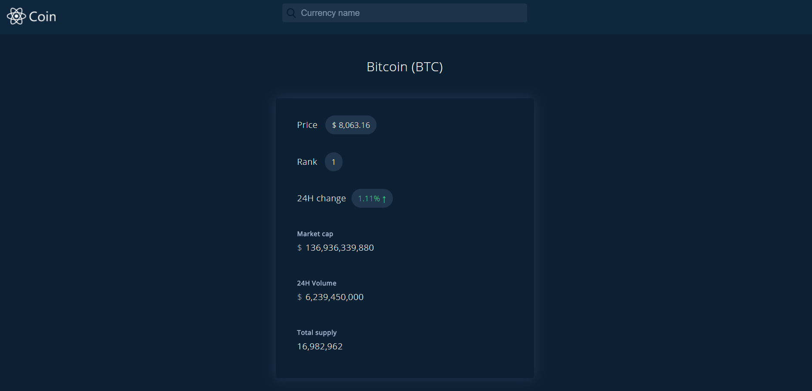

# ReactCoin
React project developed on Udilia course.



### Prerequisites

To run the project, you'll need to install:
* [**NodeJS**](https://nodejs.org/en/)

### Running the project

```
1. Download the files
2. Extract .zip file
3. Open the commandline of your SO on project directory
4. Run "npm install" to the installation of dependencies
5. Run "npm start" to start the server
6. On your browser, open "localhost:3000"

* To stop the server, type "Ctrl + C" on commandline.
```
